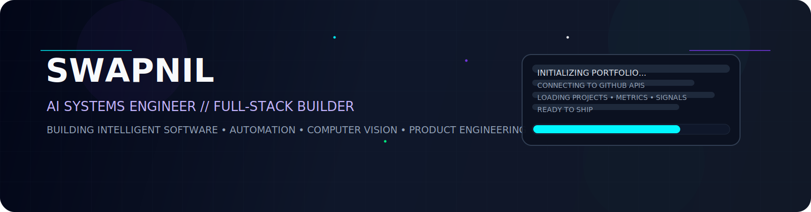
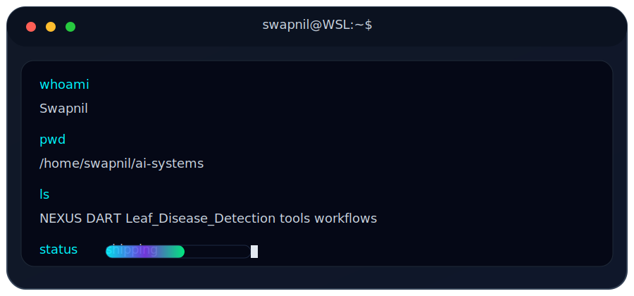

<div align="center">
  
</div>

<p align="center">
  
</p>

<p align="center">
  
  
  
</p>

---

## ⚡ Mission Control

<table width="100%">
<tr>
<td width="50%" valign="top">

```yaml
name: Swapnil
role: Full-Stack Developer
focus: AI / ML + Product Engineering
stack:
  - Python
  - JavaScript
  - TypeScript
  - React
  - Node.js
  - TensorFlow
  - Keras
  - SQL
os: Windows + WSL2
editor: PyCharm • VS Code
mode: build > explain > ship
```

</td>
<td width="50%" valign="top" align="center">



</td>
</tr>
</table>

---

## 🧠 Core Stack

<p align="center">
  
</p>

---

## 🚀 Featured Systems

<table width="100%">
<tr>
<td width="33%" valign="top">

### 🤖 NEXUS
Self-evolving AI trader for Quotex.

`Python` `Playwright` `PySide6`

[Repository](https://github.com/ItzSwapnil/NEXUS)

</td>
<td width="33%" valign="top">

### 📈 DART
Deep Adaptive Reinforcement Trader.

`Python` `Reinforcement Learning`

[Repository](https://github.com/ItzSwapnil/DART)

</td>
<td width="33%" valign="top">

### 🌿 Leaf Disease Detection
Vision-first agriculture AI research.

`TensorFlow` `DINOv3` `Explainable AI`

[Repository](https://github.com/ItzSwapnil/Leaf_Disease_Detection)

</td>
</tr>
</table>

---

## 📊 Live Analytics

<table width="100%">
<tr>
<td width="33%" align="center" valign="top">


</td>
<td width="33%" align="center" valign="top">


</td>
<td width="33%" align="center" valign="top">


</td>
</tr>
</table>

<p align="center">
  
</p>

---

## 🛰️ Runtime Signals

<p align="center">
  
  
  
  
  
</p>

---

## 🎯 What I'm Building

- Autonomous AI systems and trading automation
- Computer vision pipelines and explainable ML
- Full-stack products with polished UX
- Dev tooling that removes repetitive work
- Research-driven experimentation with measurable results

---

## 🐍 Contribution Animation

<p align="center">
  <picture>
    <source media="(prefers-color-scheme: dark)" srcset="./assets/github-contribution-grid-snake-dark.svg" />
    <source media="(prefers-color-scheme: light)" srcset="./assets/github-contribution-grid-snake.svg" />
    
  </picture>
</p>

---

## 📡 GitHub Metrics Dashboard

<p align="center">
  
</p>

---

## 🤝 Connect

<p align="center">
  <a href="https://www.linkedin.com/in/itzswapnil/">
    
  </a>
  <a href="https://www.instagram.com/itzswapnilz">
    
  </a>
  <a href="https://github.com/ItzSwapnil">
    
  </a>
</p>

<p align="center">
  <i>"Code. Learn. Build. Repeat."</i>
</p>
